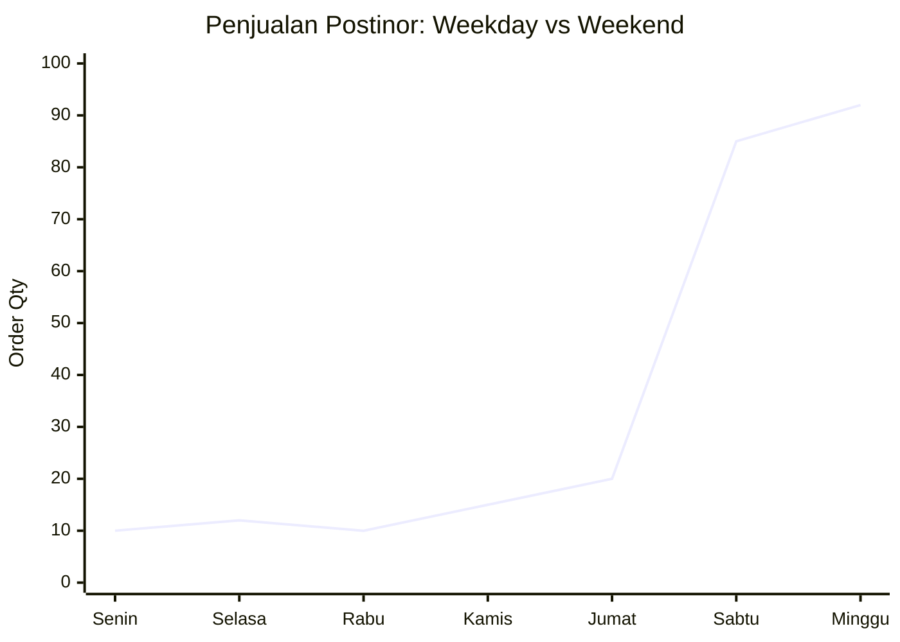

# Deep Dive: Tren Penjualan "Toko Kesehatan" Halodoc 💊

Halo tim! Berikut hasil bedah data kita hari ini. Kita coba lihat apa yang sebenarnya terjadi di balik angka-angka penjualan obat kita.

## 1. Aktivitas Bisnis (What's Happening?)
User nggak cuma pakai Halodoc buat chat dokter, tapi makin rajin belanja di **Toko Kesehatan**. Kita fokus pantau kategori yang "urgent" dan sering dicari: obat tidur, kontrasepsi, sama obat flu harian.

## 2. Informasi yang Kita Punya
Dari log transaksi, kita bisa intip:
*   **Kapan mereka beli?** (Jam kalong atau jam kantor?)
*   **Apa yang dibeli?** (Produk spesifik kayak Sedares atau Postinor)
*   **Berapa duit keluar?** (Range harga Rp20rb - Rp75rb)

## 3. Data (The Raw Truth)
Ini cuplikan **data dummy** yang kita pakai buat simulasi (file lengkapnya ada di `halodoc_sales_data.csv` ya):

| Transaction_ID | Time (WIB) | Product | Category |
| :--- | :--- | :--- | :--- |
| TRX-82910 | 01:15 | Sedares 25 mg | Obat Tidur |
| TRX-19283 | 08:30 (Minggu) | Postinor-2 | Kontrasepsi |
| TRX-77281 | 14:00 | Vicks Vaporub | Flu & Batuk |

## 4. Pola Main (The Pattern)
Ada dua tren yang **mencolok banget** dari data mingguan ini. Coba cek visualisasinya:

### Visualisasi Tren Data (Dummy)

#### 1. Lonjakan Order Obat Tidur (Malam Hari)
```mermaid
xychart-beta
    title "Penjualan Sedares per Jam (Average/Week)"
    x-axis [20:00, 21:00, 22:00, 23:00, 00:00, 01:00, 02:00, 03:00]
    y-axis "Order Qty" 0 --> 50
    bar [5, 12, 35, 42, 48, 30, 15, 5]
```

#### 2. Pola Pembelian Kontrasepsi (Weekend)


*   **Tim Insomnia:** Penjualan obat tidur selalu nge-gas pas tengah malam. Orang susah tidur, langsung buka aplikasi.
*   **The "Morning After" Effect:** Penjualan Postinor naik drastis setiap Sabtu dan Minggu pagi. Polanya konsisten.

## 5. Insight: Ada Apa Sebenarnya?
*   **Apotek Fisik Tutup = Cuan Buat Kita.** Pas tengah malam (jam 2 pagi), orang susah nyari apotek buka 24 jam. Halodoc jadi penyelamat karena ada di HP mereka.
*   **Privasi Itu Mahal.** Buat pembelian sensitif kayak kontrasepsi, orang lebih nyaman beli online. Nggak perlu tatap muka sama kasir, privasi terjaga, barang sampai depan pintu.

## 6. Rekomendasi (Action Plan)
Biar momentum ini nggak lepas, kita harus gerak:
1.  **Aktifkan Mode "Night Delivery":** Pastikan stok obat tidur & flu ready di mitra apotek yang punya kurir instan 24 jam. Jangan sampai user cancel gara-gara nggak ada driver.
2.  **Paket Privasi Weekend:** Bikin packaging yang super-polos (discreet) buat pengiriman weekend pagi. Jamin ke user kalau isi paket aman dan nggak ketebak tetangga/orang rumah.

## 7. Dampak yang Diharapkan
*   User bakal merasa, *"Gila, Halodoc ngerti banget gue butuh obat jam segini."* (Loyalty naik).
*   Order cancel berkurang karena kita udah antisipasi stok & kurir di jam-jam rawan.

## 8. Evaluasi (Check & Recheck)
Minggu depan kita pantau lagi:
*   *Fulfillment Rate* di jam 00:00 - 03:00 aman nggak?
*   Komplain soal privasi pengiriman berkurang nggak?
